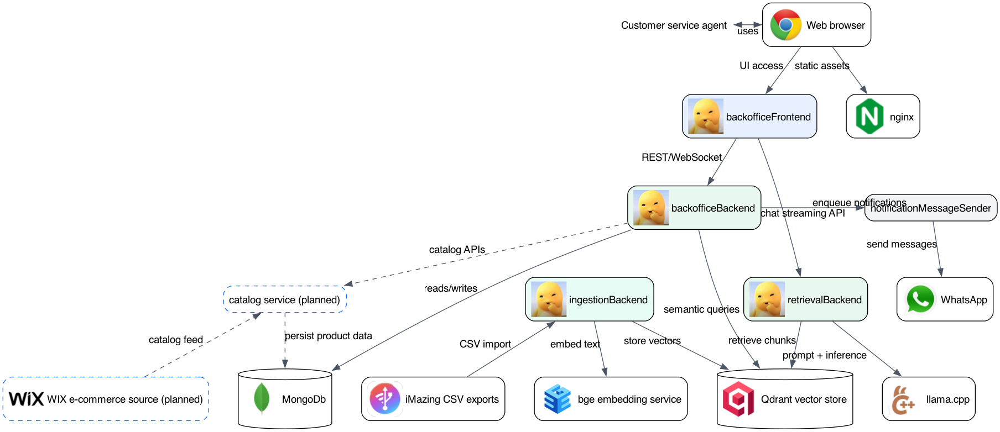

# Eury Customer Service Agent

Eury turns WhatsApp conversation history into an auditable customer-service intelligence loop: it ingests and cleans chats (including audio and media), distills them into searchable knowledge for context-aware assistant replies, and gives operations teams tools to review conversations, rate response quality, manage contacts, and keep WhatsApp profile data synchronized.

## Business Flows

This platform is organized as complementary business flows, each owned by a dedicated service boundary.

1. Conversation ingestion flow (`ingestionBackend`):
   `CSV -> preprocess -> parse -> clean -> normalize -> structure -> chunk -> embed -> store`

2. Conversation intelligence flow (`conversationIntelligenceBackend`):
   `conversation -> sentiment -> intent -> lifecycle_stage`

3. Assisted customer-chat flow:
   an operational copilot helps the customer-service team answer WhatsApp prospects and customers with automatic responses, and escalates to a human agent when the situation requires direct human handling, keeping automation useful without making the interaction feel robotic.

## Architecture

Components view:

Project READMEs:

- [backofficeFrontend README](./backofficeFrontend/README.md)
- [backofficeBackend README](./backofficeBackend/README.md)
- [retrievalBackend README](./retrievalBackend/README.md)
- [ingestionBackend README](./ingestionBackend/README.md)
- [contactsBackend README](./contactsBackend/README.md)
- [preprocessorForIMazingBackend README](./preprocessorForIMazingBackend/README.md)

### Current Scope (v1)

- `backofficeFrontend` and `backofficeBackend` for customer-service operations.
- `retrievalBackend` for `/v1/chat/completions` wrapper and retrieval-oriented LLM orchestration.
- `ingestionBackend` processing `iMazing` CSV exports.
- `contactsBackend` for Google OAuth2 and customer-contact operations through Google People API.
- `bge` for embeddings and `Qdrant` for vector storage.
- `MongoDb` for operational persistence.
- `nginx` for static asset serving.
- `notificationMessageSender` for WhatsApp outbound messages.

### Planned Next Iterations

- Extend `retrievalBackend` with a `contextBuilder` to prepare prompt-ready context.
- Add a product `catalog` fed from WIX e-commerce data.
