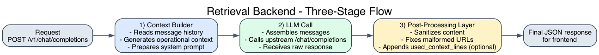

# retrievalBackend

`retrievalBackend` exposes the wrapper endpoint `POST /v1/chat/completions` and centralizes the context-generation strategy for the LLM.

## Three-Stage Flow

This retrieval layer runs as a 3-stage sequence:

1. `Context Builder`
2. `LLM Call`
3. `Post-Processing Layer`

Sequence:



Diagram source:

- `./doc/retrieval-3-stage-flow.dot`
- `./doc/retrieval-3-stage-flow.png`

## Context Generation

Context generation is organized as an application use case:

- `GenerateContextUseCase` (`src/main/application/use-cases/01-context-builder`)
- `CallLlmChatCompletionsUseCase` (`src/main/application/use-cases/02-llm-call`)
- `PostProcessChatCompletionsUseCase` (`src/main/application/use-cases/03-post-processing`)
- outbound port `ContextGenerator`
- concrete outbound adapters:
  - `NaiveContextGenerator`
  - `VectorSearchContextGenerator`

`StreamChatCompletionsUseCase` delegates system-message construction to `GenerateContextUseCase`, then calls the chat-completions port.

## Implementation Selection

The active implementation is selected in `secrets.json` under `contextGenerator.implementation`.

Supported values:

- `naive`
- `vector-search`

Example:

```json
{
  "contextGenerator": {
    "implementation": "naive",
    "naive": {
      "contextFilePath": "./etc/.../context.md"
    }
  }
}
```

Current behavior:

- `naive`: loads the file from `contextGenerator.naive.contextFilePath`, concatenates lines with spaces, and returns that context (also logs the generated context).
- `vector-search`:
  1. takes the latest user prompt;
  2. calls BGE (`embedding`) to convert the prompt into a vector;
  3. queries Qdrant (`qdrant`) to retrieve similar chunks;
  4. builds a Spanish system context with retrieved evidence;
  5. logs the generated context.

## Configuration for `vector-search`

`secrets.json` includes:

- `embedding.provider|host|port` (BGE service)
- `qdrant.url|apiKey|collectionName`
- `contextGenerator.vectorSearch.maxMatches`

## Startup Validation

On startup, a BGE connectivity validation runs:

- if `contextGenerator.implementation` is `vector-search`, it validates a real call to `/embed`.
- if it is `naive`, BGE validation is explicitly skipped.
